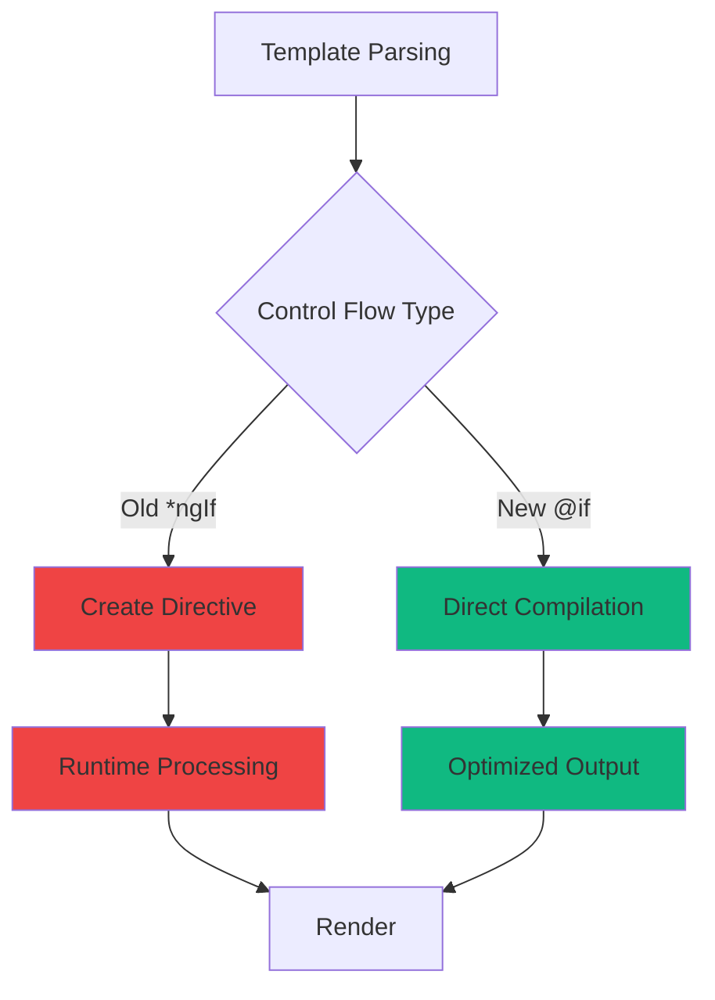

# Modern Control Flow Syntax

## From Structural Directives to Built-in Control Flow

---
layout: two-cols
---

# Why Modern Control Flow?

The Angular team introduced a new control flow syntax in Angular 17 to address long-standing pain points with structural directives.

::right::

<div class="flex items-center justify-center h-full">
  
</div>

---
layout: default
---

# The Problem with Structural Directives

<div class="grid grid-cols-2 gap-8 mt-8">
  <div class="bg-red-50 dark:bg-red-900/20 p-6 rounded-lg">
    <h3 class="text-red-600 dark:text-red-400 font-bold mb-4">❌ Old Approach</h3>
    <ul class="space-y-3">
      <li>Required importing CommonModule</li>
      <li>Runtime overhead from directive instantiation</li>
      <li>Complex syntax with microsyntax</li>
      <li>Type narrowing limitations</li>
      <li>Harder to read and maintain</li>
    </ul>
  </div>
  <div class="bg-green-50 dark:bg-green-900/20 p-6 rounded-lg">
    <h3 class="text-green-600 dark:text-green-400 font-bold mb-4">✅ New Approach</h3>
    <ul class="space-y-3">
      <li>No imports needed</li>
      <li>Compile-time optimization</li>
      <li>Clear, intuitive syntax</li>
      <li>Better type inference</li>
      <li>Improved developer experience</li>
    </ul>
  </div>
</div>

---
layout: default
---

# Real-World Impact

```ts {maxHeight:'400px'}
// Before: Component with multiple imports
import { CommonModule } from '@angular/common';

@Component({
  selector: 'app-book-item',
  standalone: true,
  imports: [CommonModule, RouterModule], // Extra dependency
  template: `
    <div *ngIf="book.cover">
      <!-- Template content -->
    </div>
    <div *ngIf="!book.cover">
      <!-- Fallback content -->
    </div>
  `
})
```

<div class="mt-6 p-4 bg-yellow-50 dark:bg-yellow-900/20 rounded-lg">
  <p class="text-yellow-800 dark:text-yellow-200">
    <strong>Problem:</strong> Every component using \*ngIf, *ngFor needs CommonModule import
  </p>
</div>

---
layout: two-cols
---

# Performance Benefits

The new control flow syntax provides significant performance improvements:

- **Faster builds** - No directive processing
- **Smaller bundles** - No CommonModule overhead
- **Better tree-shaking** - Dead code elimination
- **Optimized rendering** - Compile-time optimizations

::right::



---
layout: default
---

# Developer Experience Improvements

<div class="grid grid-cols-2 gap-6 mt-8">
  <div>
    <h3 class="text-xl font-bold mb-4 text-blue-600 dark:text-blue-400">Before</h3>
```html {1-3|5-7}
<div *ngIf="loading; else content">
  Loading...
</div>

<ng-template #content>

  <div *ngFor="let item of items">
    {{ item }}
  </div>
</ng-template>
```

  </div>
  <div>
    <h3 class="text-xl font-bold mb-4 text-green-600 dark:text-green-400">After</h3>
    ```html {1-3|4-8}
    @if (loading) {
      <div>Loading...</div>
    } @else {
      @for (item of items; track item) {
        <div>{{ item }}</div>
      }
    }
    ```
  </div>
</div>

<div class="mt-8 p-4 bg-blue-50 dark:bg-blue-900/20 rounded-lg">
  <p class="text-blue-800 dark:text-blue-200">
    <strong>Key Benefit:</strong> More readable, less nesting, clearer intent
  </p>
</div>

---
layout: center
---

# Migration is Essential

<div class="text-center">
  <div class="text-6xl mb-8">🚀</div>
  <h2 class="text-3xl font-bold mb-6">Future-Proof Your Angular Applications</h2>
  <div class="grid grid-cols-3 gap-6 mt-12 max-w-4xl mx-auto">
    <div class="p-6 bg-gradient-to-br from-blue-50 to-blue-100 dark:from-blue-900/20 dark:to-blue-800/20 rounded-xl">
      <div class="text-3xl mb-3">⚡</div>
      <h3 class="font-bold">Performance</h3>
      <p class="text-sm mt-2">Up to 90% faster builds</p>
    </div>
    <div class="p-6 bg-gradient-to-br from-green-50 to-green-100 dark:from-green-900/20 dark:to-green-800/20 rounded-xl">
      <div class="text-3xl mb-3">📦</div>
      <h3 class="font-bold">Bundle Size</h3>
      <p class="text-sm mt-2">Smaller production builds</p>
    </div>
    <div class="p-6 bg-gradient-to-br from-purple-50 to-purple-100 dark:from-purple-900/20 dark:to-purple-800/20 rounded-xl">
      <div class="text-3xl mb-3">🎯</div>
      <h3 class="font-bold">Type Safety</h3>
      <p class="text-sm mt-2">Better type inference</p>
    </div>
  </div>
</div>
